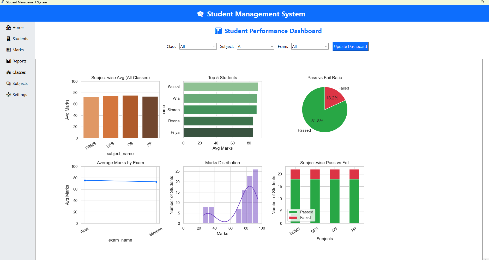
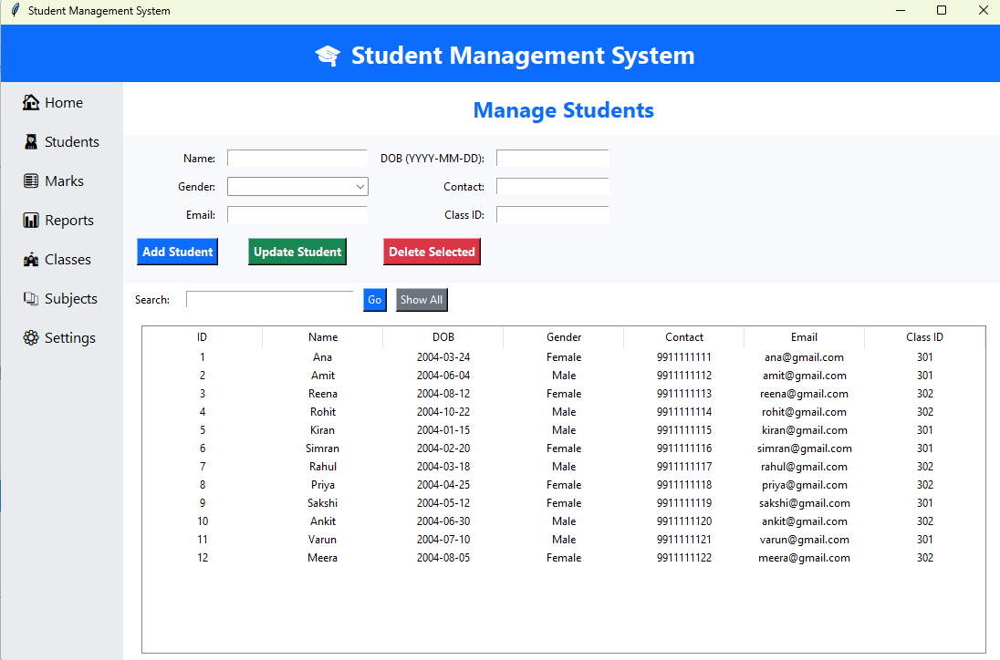
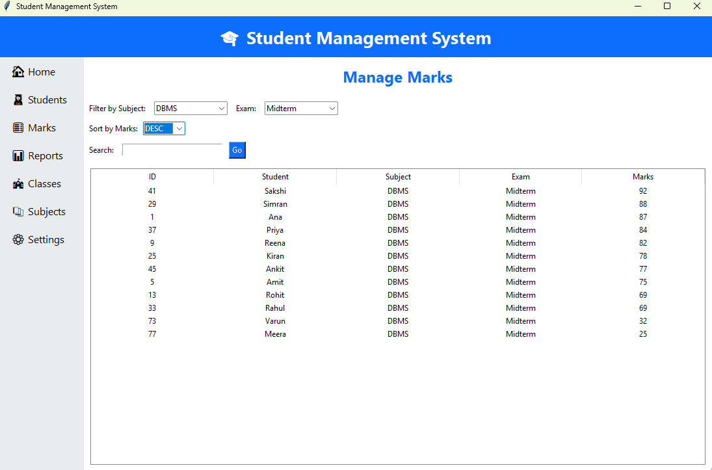

# Student Management System

A **Python–MySQL application** that simplifies academic record management. Built with **Tkinter** for the GUI and **MySQL** as the backend, this project demonstrates core DBMS concepts including relational design, SQL queries, joins, filtering, and CRUD operations.

---

## 📝 Features

* **Dashboard Navigation**: Sidebar menu for Home, Students, Marks, Reports, Classes, Subjects, and Settings. Switch pages without closing the app.
* **Marks Module**:

  * Filter by subject, exam type, and marks order
  * Search by student name or ID
  * Dynamic query building for combined filters
  * Display results in a Tkinter Treeview table
* **CRUD Operations**: Add, view, edit, and delete students, subjects, and marks.
* **Search Using LIKE Operator**: Pattern matching for flexible data retrieval.

---

## 💾 Database Design

### Tables & Relationships

* **Students** `(student_id, name, class_id, …)`
* **Classes** `(class_id, class_name)`
* **Subjects** `(subject_id, subject_name)`
* **Exams** `(exam_id, exam_name)`
* **Marks** `(marks_id, student_id, subject_id, exam_id, marks_obtained)`

### Key Concepts Applied

* **Primary & Foreign Keys**: Ensures referential integrity
* **Normalization**: Follows 3rd Normal Form
* **Joins**: Combines multiple tables to show full information
* **SQL Filtering & Sorting**: Dynamic queries for real-time dashboards

Example SQL snippet:

```sql
SELECT s.name, sub.subject_name, e.exam_name, m.marks_obtained
FROM Marks m
JOIN Students s ON m.student_id = s.student_id
JOIN Subjects sub ON m.subject_id = sub.subject_id
JOIN Exams e ON m.exam_id = e.exam_id
WHERE sub.subject_name = ? AND e.exam_name = ? AND s.name LIKE ?
ORDER BY marks_obtained ASC;
```

---

## 🖥 Screenshots

**Reports Tab**


**Students Tab**


**Marks Tab**



---

## ⚙️ Tech Stack

* **Python 3.x** – Application logic & GUI (Tkinter)
* **MySQL** – Database backend
* **Tkinter** – GUI for dashboard navigation
* **Git & GitHub** – Version control & project hosting

---

## 🚀 Getting Started

1. **Clone the repository**:

```bash
git clone https://github.com/YourUsername/Student-Management-System.git
cd Student-Management-System
```

2. **Set up virtual environment**:

```bash
python -m venv venv
venv\Scripts\activate  # Windows
source venv/bin/activate  # macOS/Linux
```

3. **Install dependencies** (if any):

```bash
pip install -r requirements.txt
```

4. **Create the MySQL database**:

* Import `std_mgmt_data1.sql`
* Update `db_conn.py` with your MySQL credentials

5. **Run the application**:

```bash
python app.py
```

---

## 🎯 Learning Outcomes

* Practical implementation of **DBMS concepts**
* Hands-on experience with **Python GUI development**
* Understanding **SQL joins, filtering, sorting, and CRUD operations**
* Building a **functional academic management dashboard**

